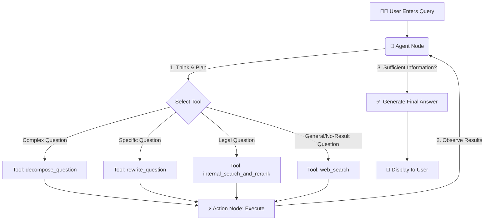

# ⚖️ AI Legal Assistant - Agentic RAG

This is an advanced Retrieval-Augmented Generation (RAG) chatbot project built on an **Agentic Architecture**. The system is capable of autonomous reasoning, planning, and flexibly utilizing multiple tools to answer complex questions about Vietnamese law and general knowledge.

The project leverages **LangChain** and **LangGraph** to construct an intelligent workflow, combining the power of the **Google Gemini** Large Language Model with specialized search tools.

## ✨ Key Features

-   **Agentic Architecture:** Instead of the traditional linear RAG pipeline (Retrieve -> Augment -> Generate), this system employs a central Agent that operates in an iterative loop: **Think -> Act -> Observe**. This allows it to methodically solve complex problems.
-   **Multi-tool Usage:** The Agent is equipped with a diverse toolkit and autonomously decides which tool to use for each task:
    -   `internal_search_and_rerank`: Searches a local legal document database (FAISS) and automatically re-ranks the results using a Cross-Encoder for enhanced accuracy.
    -   `web_search`: Fetches up-to-date information from the internet using Tavily Search.
    -   `decompose_question`: Automatically breaks down complex, multi-part questions into simpler, manageable sub-questions.
    -   `rewrite_question`: Automatically generalizes overly specific or detailed queries for more effective searching.
-   **Conversational Memory:** The system maintains the context of the conversation, allowing users to ask follow-up questions naturally.
-   **Source Citation:** Automatically cites sources (URLs) when answers are derived from web search results, enhancing transparency and trustworthiness.
-   **Web Interface:** A user-friendly web interface built with Streamlit.

## 🏛️ System Architecture

The Agentic RAG workflow is no longer a straight line but an intelligent, cyclical process:



## 📁 Project Structure

The project is organized as follows (based on our final agreed-upon structure):

```
RAG/
├── agentic_rag/
│   ├── __pycache__/
│   ├── vietnamese-bi-encoder/  # Embedding model
│   ├── vector_store/           # FAISS vector database
│   ├── agentic_bot.py          # Main Agent logic (backend)
│   └── app.py                  # Streamlit user interface
│
├── .env                        # File for API keys (DO NOT commit to Git)
├── .gitignore
├── query_transform.py          # Query transformation helper functions
├── requirements.txt            # Required Python libraries
└── README.md                   # This file
```

## 🚀 Setup and Installation

Follow these steps to set up and run the project locally.

### 1. Prerequisites
- Python 3.9+
- Git

### 2. Installation Steps

1.  **Clone the repository:**
    ```bash
    git clone https://github.com/dvnam1605/RAG_PhapLuat.git
    ```

2.  **Create and activate a virtual environment (recommended):**
    ```bash
    # Create virtual environment
    python -m venv venv

    # Activate virtual environment
    .\venv\Scripts\activate
    ```

3.  **Install the required libraries:**
    ```bash
    pip install -r requirements.txt
    ```

4.  **Set up Environment Variables:**
    Create a file named `.env` in the root directory (`RAG/`) and add your API keys:
    ```env
    # .env

    # Get from Google AI Studio
    API_KEY="AIzaSy...YOUR_GEMINI_API_KEY"

    # Get from the Tavily AI dashboard
    TAVILY_API_KEY="tvly-...YOUR_TAVILY_API_KEY"
    ```

5.  **Prepare Data and Models:**
    -   Ensure the `agentic_rag/vietnamese-bi-encoder` directory contains all the necessary files for the embedding model.
    -   Ensure the `agentic_rag/vector_store` directory contains the pre-built `index.faiss` and `index.pkl` files.

### 3. Running the Application

After the setup is complete, you can run the application in two ways:

1.  **Run the Web Interface (Streamlit):**
    Open a terminal in the `RAG` root directory and run:
    ```bash
    streamlit run agentic_rag/app.py
    ```
    Open your web browser and navigate to `http://localhost:8501`.

2.  **Run in Terminal Test Mode:**
    To quickly test the bot's logic, you can run the backend script directly:
    ```bash
    python agentic_rag/agentic_bot.py
    ```

## 🛠️ Tech Stack

-   **Language:** Python 3
-   **LLM:** Google Gemini 1.5 Flash
-   **Frameworks:**
    -   **LangChain & LangGraph:** For building and orchestrating the Agent's workflow.
    -   **Streamlit:** For building the interactive web UI.
-   **RAG & Search:**
    -   **FAISS:** For vector storage and similarity search.
    -   **Sentence-Transformers:** For creating text embeddings.
    -   **Cross-Encoder:** For re-ranking search results to improve relevance.
    -   **Tavily AI:** For real-time web search.

---
